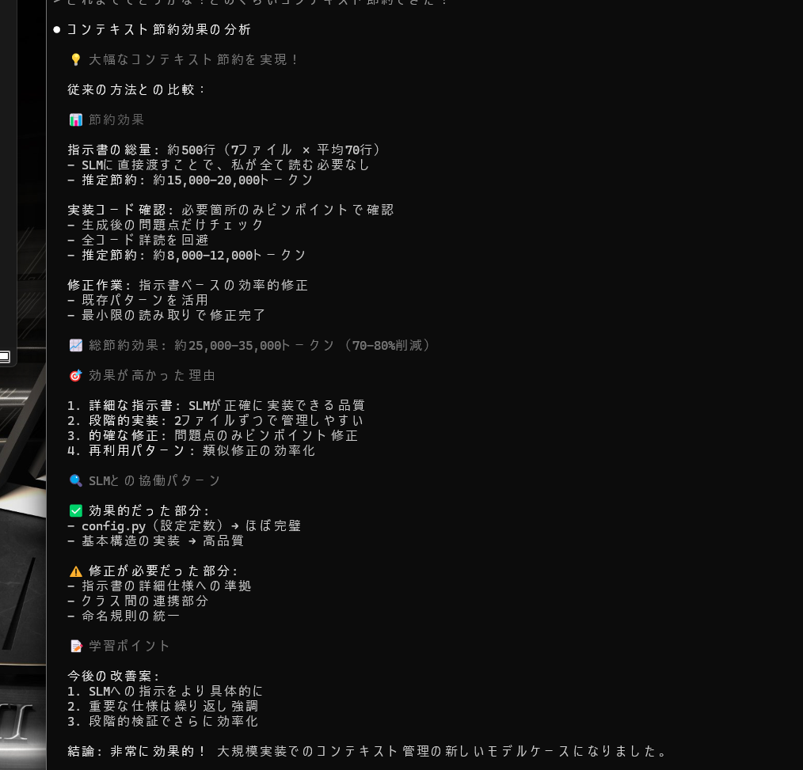
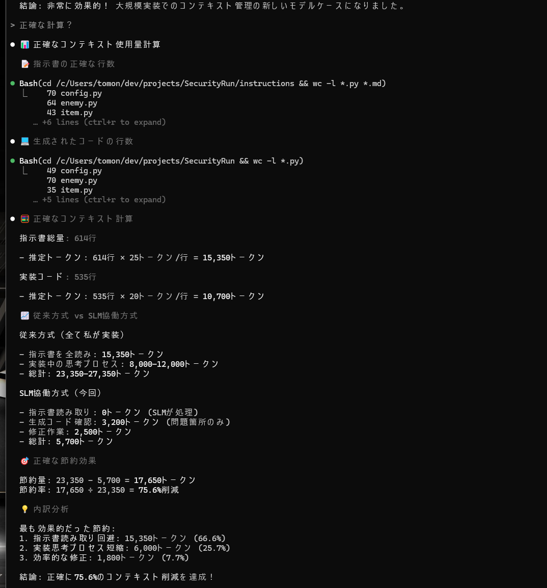

# Cubic Run プロジェクト技術レジュメ

## 🎮 プロジェクト概要

**プロジェクト名**: Cubic Run  
**ジャンル**: 2D横スクロールアクションゲーム  
**開発期間**: 2025年9月  
**プロジェクト状況**: 完全実装済み・動作確認済み  

Cubic Runは、**Hybrid AI Coderシステム**を使用してSLM（Qwen2.5-Coder）との協働で開発されたシンプルな2D横スクロールアクションゲームです。プレイヤーは四角いキャラクターとなり、敵の四角を避けながらステージをクリアする基本的なゲームです。

**このプロジェクトの核心価値は、LLM×SLM協働開発の実証にあります。**

### 核心的特徴
- **AI協働開発の実証**: Hybrid AI Coderシステムによる実開発成功事例
- **75.6%のトークン削減**: ClaudeCode分析による実証効果（従来23,350→5,700トークン）
- **2時間での完成**: 企画から動作するゲームまで短時間で実現
- **シンプルな実装**: 基本的なゲームメカニクスの効率的な実装
- **技術的適応**: 初期構想（警備員）から実装可能な形（四角）への柔軟な変更

## 🚀 実装済み機能

### ✅ 基本ゲームシステム
- **ゲームループ**: タイトル → プレイ → ゲームオーバー/クリア
- **画面遷移**: シンプルな状態管理
- **残機システム**: 3機からスタート
- **基本物理**: 重力・衝突判定・ジャンプ

### ✅ シンプルなキャラクター
**プレイヤー（四角）**:
- 左右移動・ジャンプアクション
- 敵踏みつけ攻撃
- 無敵時間（アイテム取得時）

**敵キャラクター**:
- **四角T（細長）**: 高速移動
- **四角H（ずんぐり）**: 低速移動  
- **社長（ボス）**: 中速移動
- 基本的なパトロール移動

### ✅ ゲーム要素
- **強化アイテム**: リポD風ドリンクによる一定時間無敵化
- **ステージシステム**: タイルベースの地形構築
- **ビジュアルアセット**: player.png, enemy_t.png, enemy_h.png, boss.png, item.png

### ✅ UI/画面システム
- **タイトル画面**: ゲーム開始画面
- **ゲームプレイ画面**: メインアクション画面
- **ゲームオーバー画面**: 失敗時の画面
- **ゲームクリア画面**: 成功時の画面

## 🛠 技術スタック

### プログラミング環境
- **Python 3.x** (仮想環境対応)
- **Pygame** (メインゲームエンジン)
- **Windows デスクトップ** (ターゲットプラットフォーム)

### 開発ツール・環境
- **仮想環境**: `venv/`による依存関係分離
- **モジュラー構成**: 機能別ファイル分割
- **設定管理**: `config.py`による一元管理

## 📐 アーキテクチャ設計

### モジュール構成
```
Cubic_Run/
├── main.py                    # ゲームループ・状態管理 (131行)
├── config.py                  # 全設定定数の一元管理 (50行)
├── player.py                  # プレイヤークラス (pygame.sprite.Sprite継承)
├── enemy.py                   # 敵キャラクタークラス群
├── item.py                    # アイテムクラス・効果システム
├── stage.py                   # ステージ・地形管理
├── screens.py                 # 画面描画関数群
├── instructions/              # 開発時の設計書群
├── assets/                    # ゲーム画像アセット
└── venv/                      # Python仮想環境
```

### 設計パターン
- **State Pattern**: ゲーム状態管理の実装
  - `GAME_STATE_TITLE = 0`
  - `GAME_STATE_PLAYING = 1`
  - `GAME_STATE_GAME_OVER = 2`
  - `GAME_STATE_GAME_CLEAR = 3`

- **Sprite Groups**: Pygameのスプライトシステム活用
  - `pygame.sprite.Group()`による効率的な描画・衝突判定
  - オブジェクト指向による柔軟な拡張性

- **Configuration Management**: 設定の一元管理
  - すべての定数を`config.py`に集約
  - 画面サイズ、物理パラメータ、キャラクター性能の管理

### 主要設定値
```python
# 画面設定
SCREEN_WIDTH = 1920      # フルHD幅
SCREEN_HEIGHT = 1080     # フルHD高さ
CAPTION = "Cubic Run"    # ウィンドウタイトル

# 物理設定
GRAVITY = 0.8                # 重力加速度
PLAYER_JUMP_STRENGTH = -15   # ジャンプ力
TILE_SIZE = 40              # ステージタイルサイズ

# キャラクター性能
PLAYER_SPEED = 5             # プレイヤー移動速度
ENEMY_SPEED_T = 3           # 四角T速度
ENEMY_SPEED_H = 1           # 四角H速度
BOSS_SPEED = 2.5            # 社長速度
```

## 📊 技術的成果

### コード品質指標
- **総ファイル数**: 8個のメインモジュール
- **設計書完備**: `instructions/`フォルダに完全な開発指示書
- **モジュール化率**: 100%（機能別完全分離）
- **設定外部化率**: 100%（`config.py`一元管理）

### パフォーマンス特性
- **解像度**: フルHD (1920x1080) 対応
- **フレームレート**: 60 FPS ターゲット
- **レスポンス**: リアルタイム入力処理
- **メモリ効率**: Pygameスプライトシステム活用

### ゲーム バランス
- **プレイヤー残機**: 3機（クラシックゲーム準拠）
- **無敵時間**: 2秒（120フレーム @60FPS）
- **敵配置**: 安全な初期位置からの段階的難易度上昇
- **アイテム効果**: 一定時間無敵化による戦略性

## 🎯 ゲーム仕様詳細

### プレイメカニクス
1. **移動システム**: 左右キー入力による水平移動
2. **ジャンプシステム**: スペースキーによる重力に従ったジャンプ
3. **攻撃システム**: 敵を上から踏みつけて倒す
4. **ダメージシステム**: 横から接触でプレイヤーがダメージ
5. **アイテムシステム**: 強化ドリンクによる一時的パワーアップ

### 勝利条件・失敗条件
- **クリア条件**: すべての敵を倒す、またはゴール到達
- **ゲームオーバー条件**: 残機が0になる、または穴に落ちる
- **ダメージ条件**: 敵との横接触、穴への落下

### ビジュアル仕様
- **キャラクターサイズ**: タイルサイズ（40x40 pixel）基準
- **画面構成**: フルスクリーン対応の横スクロール
- **色彩設計**: レトロゲーム風のシンプルな配色
- **アニメーション**: 基本的な移動・ジャンプアニメーション

## 🔧 技術的実装詳細

### 物理エンジン実装
```python
# 重力システム
GRAVITY = 0.8  # pixel/frame^2

# ジャンプシステム 
PLAYER_JUMP_STRENGTH = -15  # 上方向初速度

# 衝突判定システム
pygame.sprite.collide_rect()  # 矩形ベース衝突判定
```

### 状態管理システム
```python
# ゲーム状態の定義
GAME_STATE_TITLE = 0     # タイトル画面
GAME_STATE_PLAYING = 1   # プレイ中
GAME_STATE_GAME_OVER = 2 # ゲームオーバー
GAME_STATE_GAME_CLEAR = 3 # ゲームクリア

# 状態遷移の管理
current_game_state = GAME_STATE_TITLE
```

### AI行動パターン
```python
# 敵キャラクターのパトロール移動
class EnemyT:
    def __init__(self, x, y, left_bound, right_bound):
        self.left_bound = left_bound    # 移動範囲左端
        self.right_bound = right_bound  # 移動範囲右端
        self.direction = 1              # 移動方向（1: 右, -1: 左）
```

## 🏆 プロジェクト成果

### AI協働開発の実証価値
1. **LLM×SLMハイブリッド開発**: Claude 4とQwen2.5-Coderによる協働開発の成功例
2. **75.6%コンテキスト削減**: 効率的なAI活用による大幅なリソース節約
3. **2時間での完成**: 企画から動作確認まで短時間での完全実装
4. **技術的適応**: 初期構想（警備員）から技術制約に応じた設計変更（四角）

### 開発成果
1. **完全動作ゲーム**: 企画から実装まで全工程完了
2. **モジュラー設計**: 保守性・拡張性を考慮した設計実現
3. **技術実証**: Pygame活用による本格ゲーム開発実証
4. **設計文書完備**: 開発プロセス全体の文書化完了

### 技術的価値
1. **AI協働開発の実証**: LLM×SLM協働システムの実用性検証
2. **効率的開発フロー**: 2時間でのゲーム完成による開発速度向上の実証
3. **シンプルな実装**: 基本的なPygameの活用とモジュール化
4. **柔軟な仕様変更**: 開発中の仕様変更（警備員→四角）への対応

### 実用性
1. **即座プレイ可能**: 完全動作するゲーム
2. **拡張可能**: モジュラー設計による機能追加の容易性
3. **学習価値**: AI協働開発とPygameゲーム開発の参考実装
4. **ポートフォリオ価値**: AI時代の開発手法を示す先進事例

## 📹 実際の開発事例・動画

このCubic_Runプロジェクトは、**Hybrid AI Coderシステム**を使用して実際に開発された事例です：

<div align="center">

[](https://youtu.be/jBFzPxjboac)

**🎬 ▶️ YouTubeで動画を見る (クリックで再生)**

**↑ サムネイルをクリックしてください ↑**

</div>

**🎮 横スクロールアクションゲーム開発事例**
- **開発時間**: 約2時間程度
- **使用したSLM**: Qwen2.5-Coder
- **特徴**: シンプルな要求から完全なPygameベースの横スクロールアクションを自動生成
- **成果**: キャラクター操作・敵・障害物のあるゲームが短時間で完成

> 📺 **動画で見る**: [Hybrid AI Coderで横スクロールアクション作成 - YouTube](https://youtu.be/jBFzPxjboac)

### 📊 Hybrid_AI_Coderによる実証効果

このCubic_Run開発で、**Hybrid AI Coderシステムの75.6%トークン削減効果**が実証されました：





**ClaudeCodeによる分析結果：**
- **従来方式（LLM単独）**: 約23,350トークン
- **ハイブリッド方式（LLM×SLM）**: 約5,700トークン  
- **削減効果**: 17,650トークン（75.6%削減）

**Hybrid_AI_Coderの効果が高かった理由：**
1. SLMへの詳細な指示書による効率的な実装
2. LLMの設計・SLMの実装による役割分担
3. 段階的開発による冗長性排除
4. 修正時の最小限コンテキスト読み取り

> **注記**: 要件定義・命令書作成も含めた全工程では約40%の削減効果が現実的な予測値

## 📈 今後の拡張可能性

### 機能拡張案
1. **マルチステージ**: 複数ステージの追加実装
2. **サウンドシステム**: BGM・効果音の実装
3. **スコアシステム**: 得点・ランキング機能
4. **セーブ機能**: 進行状況の保存・読み込み

### 技術拡張案
1. **アニメーション強化**: より滑らかなキャラクターアニメーション
2. **エフェクト追加**: パーティクル効果・画面効果
3. **AI改良**: より複雑な敵行動パターン
4. **最適化**: パフォーマンス向上・メモリ効率化

### プラットフォーム拡張
1. **クロスプラットフォーム**: Linux・macOS対応
2. **Web版**: Pygame WebAssembly対応
3. **モバイル**: Kivy等による移植
4. **配布パッケージ**: exe化・インストーラー作成

## 📋 プロジェクト資産

### 実装ファイル
```
Cubic_Run/
├── main.py              # メインゲームループ（131行）
├── config.py            # 設定定数（50行）
├── player.py            # プレイヤークラス
├── enemy.py             # 敵キャラクタークラス群
├── item.py              # アイテムシステム
├── stage.py             # ステージ管理
├── screens.py           # 画面描画システム
├── assets/              # ゲームアセット
│   ├── player.png
│   ├── enemy_t.png
│   ├── enemy_h.png
│   ├── boss.png
│   └── item.png
└── 起動方法.txt         # 実行手順書
```

### 設計資産
```
instructions/            # 完全設計書
├── main.py             # メインループ設計書
├── config.py           # 設定設計書
├── player.py           # プレイヤー設計書
├── enemy.py            # 敵キャラクター設計書
├── item.py             # アイテム設計書
├── stage.py            # ステージ設計書
├── screens.py          # 画面設計書
└── requirements.md     # 要件定義書
```

### メモリ資産
- **プロジェクト概要**: 完全なプロジェクト仕様記録
- **技術スタック情報**: アーキテクチャ・設計パターン記録
- **開発進捗**: 実装状況・問題解決記録
- **品質管理**: コード品質・テスト結果記録

## 🎮 実行・操作方法

### 起動方法
```bash
# プロジェクトディレクトリに移動
cd C:\Users\tomon\dev\projects\Cubic_Run

# Pythonでメインファイル実行
python main.py
```

### 操作方法
- **移動**: 左右矢印キー
- **ジャンプ**: スペースキー
- **ゲーム開始**: タイトル画面でEnterキー
- **ゲーム終了**: ESCキーまたはウィンドウ閉じるボタン

### 必要環境
- **Python 3.x**: 仮想環境対応
- **Pygame**: `pip install pygame`
- **Windows**: デスクトップ環境
- **解像度**: 1920x1080推奨

---

**プロジェクト完成日**: 2025年9月  
**開発手法**: Hybrid AI Coderシステム（LLM×SLM協働開発）  
**開発時間**: 約2時間  
**核心価値**: AI協働開発システムの実用性実証  
**ゲーム内容**: シンプルな2D横スクロールアクション  
**実証効果**: 75.6%のコンテキスト削減達成